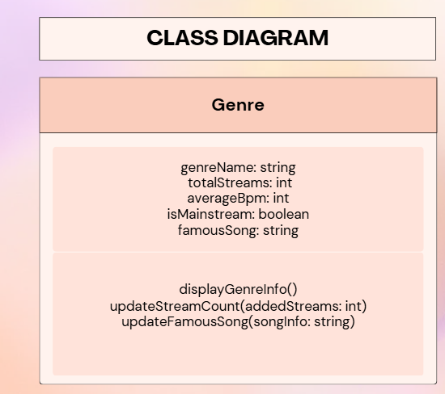

# Computer Science 3 Portfolio

## Student Information
**Name:** Kate Mycah G. Grajo

**Section:** Magnesium

# Quarter 1

* [View my Computational Thinking Exercise](q1/ctskillsMagnesiumGrajo.md)
* [Chinese Zodiac Program Code](q1/zodiacMagnesiumGrajo.py)
* [Chinese Zodiac Documentation](q1/zodiacMagnesiumGrajo.md)
* [ILA 3-1: Applying the Four Pillars of OOP](q1/ila_oop.md)
* [OOP Act](q1/classObjectUML.md)
### OOP Class Diagram
