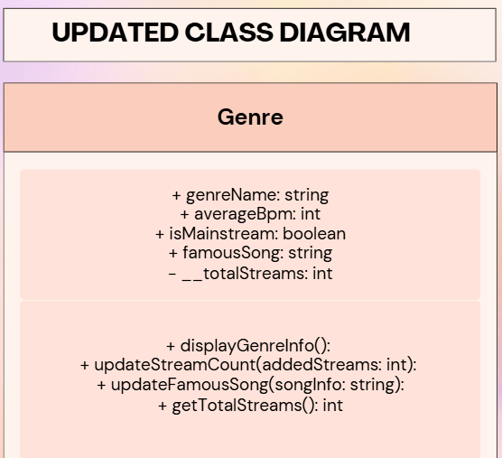
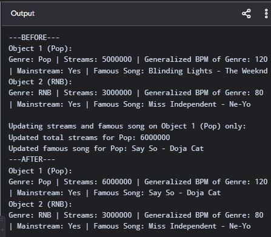
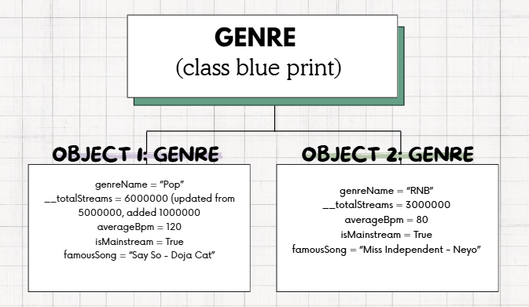

# Class Attributes and Methods

## Previous Design
[Link to my previous activity](classObjectUML.md)

## Design Revision
No major changes were needed from my original design.

## Visibility Decisions
| Attribute | Data Type | Visibility | Reason |
|:---|:---|:---|:---|
| genreName | string | Public (+) | The primary identifying label of the genre; represents the public title/identity of the genre.|
| totalStreams | int | Private (-) | Protects stream statistics from direct manual modification, ensuring numbers are updated safely.|
| averageBpm | int | Public (+) | Represents the general tempo of the music genre, which is used to provide information about the genre to the populace. |
| isMainstream | boolean | Public (+) | Indicates public commercial status, which is safe to view or evaluate diretly by external modules. |
| famousSong | string | Public (+) | Stores the top hit title and artist, which is safe to access oublicly in streaming views.

## Updated UML Class Diagram

## Python Implementation
[View Python Source](classImplementation.py)

## Test Run

## Object Diagram

## Analysis

### Why did you make your chosen attribute private?
Before choosing certain attributes, I’ve learnt that if a variable is public, any piece of code can
change it to a bad value. Making it private forces the program to use special functions (called getters and setters) to read or change the information. As previously learned, this can be also connected to the radiance of encapsulation — encapsulation bundles data and the rules that protect it into one single package. I made totalStreams private to prevent
unauthorized modification of streaming data from outside the class. This help prevent the possibility of external code overwriting totalStreams directly (eg.,someone could accidentally set negative stream values or wipe
out global statistics). Keeping it private ensures that stream adjustments only occur through controlled class methods.

### Which method changes the state of your object?
Basically, an object’s state is the data stored in its variables (attributes) at any given moment. With this, since both of the methods I chose change that data, then both methods also change the state. The updateStreamsCount(addedStreams) method changes the internal state of the object by adding new streams to the private __totalStreams attribute. It takes a number (addedStreams) and adds it into the existing total. As for the state change, it overwrites the old number stored in __totalStreams with a new number. Additionally, updateFamousSong(songInfo) alters state by updating the famousSong string whenever a new song becomes the top hit. It takes new information (songInfo) about a top hit song. It replaces the old text stored in famousSong with the new song text.

### How did your two objects demonstrate that instances are independent?
When Object 1 and Object 2 were created, the computer built two completely different sanctuaries. within the confines of its memory. Because of this distinctness or difference in “sanctuaries,” changing information on one sanctuary will never disrupt the other. When I called updateStreamsCount (6000000) and updateFamousSong (Say So - Doja Cat) on Object 1 (Pop), its streams inscreased by 1000000 (initially from 5000000) and the top hit inscribed is altered. Meanwhile, Object 2 (RNB) kept its original stream count 3000000 and its orignal famous song (Miss Independent - Ne-Yo).

### What is the difference between your class diagram and your object diagram?
The class diagram acts as an abstract blueprint that defines the general properties, data types, visibility (+/-), and methods available to all Genre objects. Simply, it is just basically a list of rules
or a blank template. It shows what every single object created from it is allowed to have. Symbols for visibility are utilized to indicate whether it is private (-) or public (+). In contrast, the
object diagram shows concrete instances (Object 1 and Object 2) at a specific point in time after code execution, displaying actual stored values rather than data definitions. I like to think of it as the mosaic of the real data at a snapshot moment or exact moment while the program is embarking on its odyssey. It shows real names and real numbers instead of data types. For instance, my class diagram defines the strict rules and data types for the Genre class, showing
placeholders like genreName: string or isMainstream: boolean along with access symbols like public (+) and private (-). It also maps out the action methods the engraved objects can perform, such as updateStreamCount() and getTotalStreams(). In contrast, the object diagram ignores these data types, visibility symbols, and methods entirely to focus solely on the state of instances like Object 1 and Object 2 at a specific moment during runtime. Instead of
defining what the variables should be, the object diagram displays the actual data values stored in memory, showing real assignments such as genreName = "Pop" or totalStreams = 5000000.