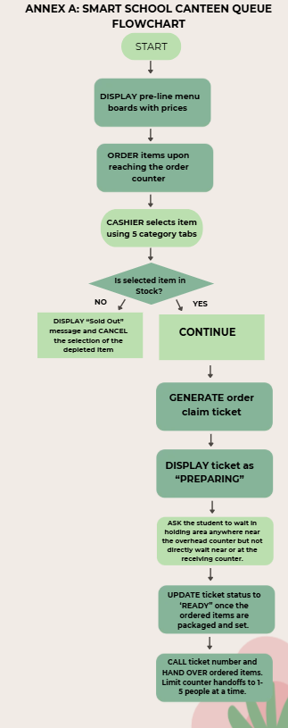

# Smart School Canteen Queue
**Submitted by:** Kate Mycah G. Grajo
**Section:** 9 - Magnesium

# Step 1: Identify the Big Problem

**Main Problem:**
The PSHS school canteen experiences severe congestion and operational inefficiency during lunch break because order selection, item total calculation, payment handling, and inventory tracking are all done manually without an automated system.

# Step 2: Break Down the Main Problem into Sub-Problems
**Pre-Purchase Decision Delays:** Some students spend a significant amount of time reviewing food options. Furthermore, most food items are displayed without visible price tags, forcing students to inquire about prices at the cashier and recalculate their budget at the counter, further causing prolonged decision-making at the ordering counter.

**Transaction & Change Computation Bottleneck:** Cash-based exchanges require physical verification, manual tallying, and coin change calculation, creating a severe operational bottleneck per customer. 

**Lack of Real-Time Stock Monitoring:** Canteen staff have no automated visibility over stock depletion, leading to unexpected food run-outs mid-service and order fulfillment failures. This may then prompt the cashier to handle order changes as well as prompt the student to re-decide, re-calculate budget, or step out of line, causing major delays at the counter. 

**Receiving Counter Congestion:** Limited kitchen staff, wrong order dispatches, and limited space cause students to cluster around the pickup counter while waiting indefinitely for their food. 

# Step 3: Define Computational Thinking Approaches
| Sub-Problem | CT Skill | Proposed Solution | 
| :--- | :--- | :--- | 
| Pre-Purchase Decision Delays | Decomposition | Isolate order decision-making from checkout by installing static printed menu boards with updated prices along the line, allowing students to calculate their budget and finalize choices before reaching the counter. |
| Transaction & Change Computation Bottleneck | Abstraction and Pattern Recognition | Simplify cash handling by having the cashier simply tap the ordered items into a computerized register. The computer automatically pulls the item prices from a database, adds up the total, and calculates the exact change due. Instead of typing the item and price of the item manually, the cashier taps systemized buttons, significantly reducing register typing time. Furthermore, the register interface is structured into 5 major category tabs (Rice Meals, Snacks, Drinks, Viands [only], Extras). Cashiers locate any item in 2 taps maximum without typing, while a "Frequently Ordered" home tab automatically pins top lunch items for 1-tap checkout. This minimizes the manual typing, leaving customer cash input as the only manual entry.
| Lack of Real-Time Stock Monitoring | Algorithm Design | Link cashier order entries to a real-time portion counter in the register system. Kitchen staff input the total batch count (e.g., 60 Buko Raps) before lunch. For viands and rice, the kitchen staff can input estimated ladle servings per cooked batch (e.g., 50 portions per pot). The system deducts n servings per order and triggers a low-stock alert at 5 remaining portions. As the cashier taps each order, the system automatically subtracts portions and triggers a "Sold Out" status on the pre-line display when stock reaches zero. | 
| Receiving Counter Congestion | Decomposition and Algorithm Design|  Upon payment, the register prints a claim ticket with an order number. The order status is sent to an overhead display screen ("Preparing" vs. "Ready for Pickup"). Students wait in a designated open holding area away from the counter and approach only when their number is called/shown on the screen. Kitchen staff can only advance a ticket status to Ready for Pickup when the meal is physically packaged and placed on the receiving area. It limits counter hand-offs to 1-5 students at a time.| 

# Reflection:
**Pre-Purchase Decision Delays (Decomposition)** - Breaks down the single checkout process into two independent stages. By installing static menu boards along the pre-line queue, order decision-making is isolated from payment processing, allowing students to finalize choices before reaching the counter. It leverages Pattern Recognition by analyzing top-selling lunch trends to pin dynamic items to a "Frequently Ordered" tab for 1-tap checkout. 

**Transaction and Change Computation Bottleneck (Abstraction and Pattern Recognition)** - Hides underlying price databases and change calculations behind a 5-category touch grid (Rice Meals, Snacks, Drinks, Viands [only], Extras).

**Lack of Real-Time Stock Monitoring (Algorithm Design)** - Links cashier order entries to a real-time portion counter in the register system. Kitchen staff input initial batch counts (e.g., 60 pre-packaged items) or estimated ladle servings per cooked pot (e.g., 50 portions) before lunch. The system applies a conditional algorithm: for every item tapped by the cashier, it subtracts n portions from the active database count. When the remaining count reaches a threshold, the algorithm automatically triggers a low-stock alert on the kitchen terminal. Once stock hits zero, the algorithm automatically updates the pre-line board to "Sold Out" and disables the item button on the cashier interface to prevent overselling. Example:
`IF Stock == 0 THEN Update "Sold Out" Display and Lock Register Button`

**Receiving Counter Congestion (Decomposition and Algorithm Design)** - Establishes a step-by-step state transition workflow (Payment > Ticket > State: Preparing > State: Ready > Pickup). The overhead screen manages student congestion, keeping them in their desired waiting zones until their number transitions to Ready without overcrowding the counter.

Decomposition is the practice of breaking a complex problem into smaller, isolated, and manageable sub-problems. In a typical school canteen, line congestion seems like a single massive issue. However, attempting to fix "the line" as a whole fails because the delay is actually caused by several different operational bottlenecks happening at the exact same spot. By applying the essence of Decomposition, I was able to separate the student journey into four distinct, independent stages:

- Pre-Purchase Decision Stage: Deciding what to buy and checking prices.

- Checkout & Payment Stage: Entering orders and handling transactions.

- Kitchen Operations Stage: Tracking cooked portion quantities and stock limits.

- Food Hand-off Stage: Waiting for orders and picking up food.

Ultimately, decomposition makes complex problems manageable by breaking a chaotic system into smaller, independent parts. This then allows people to pinpoint the exact root causes of bottlenecks, design targeted solutions for specific steps without disrupting the entire process, and keep the system working even if one part fails. 

# Step 4: Draw a flowchart or write a pseudocode for the identified sub-problem

