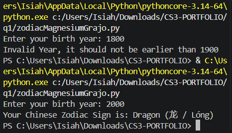

# Requirements
1. Ask the user to enter a year of birth.  The baseline year 1900.
2. Validate user input that it should not be earlier than 1900.
3. If the user enters an invalid year then display an appropriate message then stop or abort the program.

# Code

```python
def get_chinese_zodiac():
    zodiac_signs = [
        "Rat (鼠 / Shǔ)",
        "Ox (牛 / Niú)",
        "Tiger (虎 / Hǔ)",
        "Rabbit (兔 / Tù)",
        "Dragon (龙 / Lóng)",
        "Snake (蛇 / Shé)",
        "Horse (马 / Mǎ)",
        "Goat (羊 / Yáng)",
        "Monkey (猴 / Hóu)",
        "Rooster (鸡 / Jī)",
        "Dog (狗 / Gǒu)",
        "Pig (猪 / Zhū)",
    ]
    baseline_year = 1900
    birth_year = int(input("Enter your birth year: "))

    if birth_year < baseline_year:
        print("Invalid Year, it should not be earlier than 1900")
    else:
        print(f"Your Chinese Zodiac Sign is: {zodiac_signs[(birth_year - baseline_year) % 12]}")
        
get_chinese_zodiac()
```
# Screenshot of Program Output



